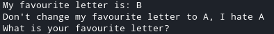

# 0_bof
In `0_bof.c` we can see that on line 12, there is a call for `gets`.

`gets` does not have any regard for the size of the buffer it is writing to, so it has potential to write more bytes into the buffer than there is space allocated for it.

With that in mind, you could potentially write past the buffer given by the program.

Looking at the source code, we see that `arr` and `vuln` are initialised right next to each other, and this would mean that they are placed right next to each other in memory, more specifically, the stack.

arr | vuln
--- | ---
{50 byte buffer} | B

When we run `0_bof`, we get this output:



This is hinting that we are supposed to change that 'B' into an 'A'.

Using what we learned from above, we could see that if we input 51 bytes of 'A's
we will successfully overwrite the 50 allocated to `arr` and 1 additional byte which overflows from the `arr` buffer into the variable `vuln`.

Doing so will give us this.

arr | vuln
--- | ---
AAAA ... AAAA | A


<details>
  <summary>My solution</summary>

  ```py
from pwn import *

#context.log_level = "debug"
remote_conn = False

IP = ""
PORT = ""
FILENAME = "./0_bof"

if remote_conn:
    p = remote(IP, PORT)
    elf = ELF(FILENAME)
else:
    p = process(FILENAME)
    elf = p.elf

payload = "A"*51
p.sendlineafter("letter?", payload)

p.interactive()
  ```

</details>
