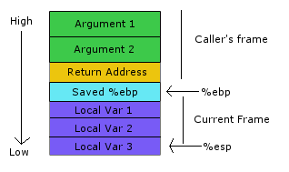

# 3_feed_me

For the purpose of learning how to exploit binaries without the source code, I will not reference it in this or any future binaries.

Instead, I will use some tools to achieve what I need (not all of them will be used here).

- [`pwndbg`, a Python module for GDB](https://github.com/pwndbg/pwndbg)
- [`cutter`, pretty much a GUI for `radare2`, a popular reverse engineering framework, `rz-ghidra` is a decompiler ported from `Ghidra` to cutter.](https://cutter.re/)
- [`BinaryNinja`, similar to Cutter/radare2, I juggle between Cutter and BinaryNinja, although they ultimately achieve the same things, I just find things like the search feature nicer on one over the other](https://binary.ninja/)
- [`Ghidra`, a software reverse engineering tool developed by the NSA, I pretty much only used the decompiler back when `rz-ghidra` wasn't as good](https://ghidra-sre.org/)

For most of these challenges, I will refer to the disassembly rather than the decompiled code.

In `cutter`, I can see the instruction `call vuln` inside of `main`, and on the sidebar I can see `sym.vuln` so I will move forward by looking into that function.\
Inside of `vuln`, we can see that there is a call for `gets`.


Like in `0_bof` and `1_bof`, we know that there will be a buffer overflow and with that, we could possibly control a few variables to get past a few `if` statements and then to a win function.\
A `win` function can be seen in the functions list and inside of `win`, there is `call system` instruction.\
If we right click on the `sym.vuln` function in the functions list and choose `Show X-Refs`, or press `X`, we will see where it has been referenced, and we see it being referenced in `main` like we saw before.\
Now let's do the same for `sym.win`, here we find no references to it. What can we do about this?

We saw before in `0_bof` and `1_bof` that we overwrote local variables, and if we think about how the stack is layed out, we can notice that the `Return Address` is above the `Saved %ebp` and local variables.\
So with this, having written over local variables already, we can conclude that writing even further will overwrite the return address of a function.



What is the return address? Why rewrite it?

The return address is the address a program will return to upon exiting functions. So for example, `main` calls `vuln`, once inside of vuln, how do we get back to `main` to continue the execution of main?\
`vuln` is given the address of `main` plus the offset from where it called `vuln` so that it will return to where it called vuln and execute the instructions after that, rather than executing from the start of `main` again.\
So if we can rewrite this return address, we can divert the program execution to run `win`.

<details>
<summary>My Solution</summary>

```python
from pwn import *

#context.log_level = "debug"
remote_conn = False

IP = ""
PORT = ""
FILENAME = "./3_feed_me"

if remote_conn:
    p = remote(IP, PORT)
    elf = ELF(FILENAME)
else:
    p = process(FILENAME)
    elf = p.elf

payload = b"A"*76 + pack(elf.sym['win'])
p.sendlineafter("something?", payload)

p.interactive()
```

</details>
